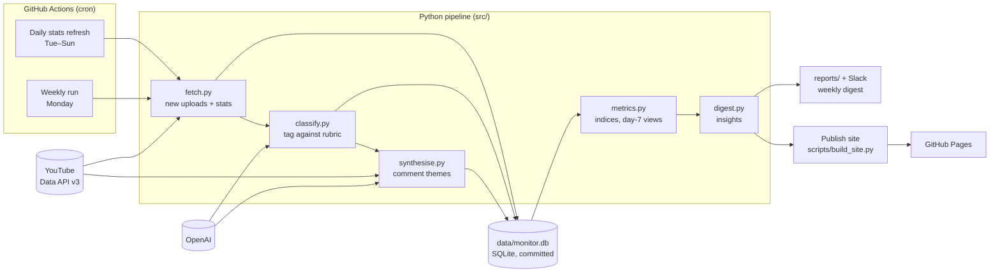

# Creative Monitor

Competitive creative intelligence for YouTube. Creative Monitor watches competitor
channels and tells a creative strategist **what's performing, why, and what the
audience is saying** — and it keeps itself up to date with no one pressing a button.

**Live site:** https://jennthecoder.github.io/creative_monitor/

Currently monitoring *The Diary Of A CEO* and *What Now? with Trevor Noah*.

---

## Always fresh, fully automatic

Nothing in this project needs to be run by hand. GitHub Actions pulls new data on a
schedule, commits it, and republishes the site:

| When (UTC) | Job | What it does |
|---|---|---|
| **Every day** Tue–Sun, 13:00 | `Daily stats refresh` | Picks up new uploads and snapshots views, likes and comments for each channel's 100 most recent videos. YouTube API only (about 6 quota units a day). |
| **Every Monday**, 13:00 | `Weekly creative monitor` | Everything the daily job does, plus: classifies new videos with an LLM, summarises their comments, writes the weekly digest and posts it to Slack. |
| **After each run** (and on code pushes) | `Publish site` | Rebuilds the website from the latest data and deploys it to GitHub Pages. |

So the site you open always reflects the latest run, and the "Last run" indicator in
the top right shows exactly when that was.

Daily snapshots matter: they give every video an exact view count at day 7, which is
how videos are compared fairly (see [How performance is measured](#how-performance-is-measured)).

---

## What it tells you

**Weekly digest** — the story of the week in one sentence, then for each channel:

- **At a glance** — top breakout, biggest miss, what's working, and any shift in strategy.
- **What's working** — creative attributes that beat the channel's norm more often than
  its videos do in general, e.g. *"Quote titles: 10 of 12 beat 1.5x their format median
  (83%, against 43% for the channel overall)."* Patterns that hold on more than one
  channel are called out as the strongest evidence.
- **Breakouts and misses** — videos that crossed 7 days old this week, each with its
  performance index, a reach-vs-resonance read, its creative levers, and what viewers
  are saying.
- **Just launched** — early signal on videos under 7 days old.
- **Shifts** — when a channel changes direction (*"5 of the last 5 videos are
  informative tone, up from 2 of 5"*) or posting cadence.

**Channel pages** — every tracked video, filterable by format and sortable by newest,
best or weakest, with the channel's baselines and patterns.

**Video pages** — a scorecard (performance, engagement, like and comment rates against
the channel norm), the full creative classification with the model's rationale, and
audience objections, questions and praise.

---

## How performance is measured

Raw views measure channel size and video age, not creative quality. So every number is
**relative to the channel's own norm**:

- **Performance index** — a video's views divided by the median of the channel's last
  20 videos *of the same format* (Shorts, clips and full episodes are judged
  separately). `1.0x` is typical; red marks `1.5x` or better, and red is used for
  nothing else in the interface.
- **Compared at the same age** — views are compared at day 7, so a video that has had
  two months to collect views doesn't look like a breakout next to one that's a week
  old. Until a format has enough day-7 readings, today's totals are used and the
  interface says so.
- **Reach vs resonance** — like and comment rates, also indexed against the channel,
  separate a title/thumbnail win from a content win:
  - *Reach and resonance* — beat the norm on views and engagement.
  - *Packaging-led* — views beat the norm, engagement didn't.
  - *Under-packaged* — views were weak but viewers engaged strongly.
- **Hit rate, not averages** — patterns report how often an attribute beat `1.5x`,
  with the sample size and the channel's base rate, so one viral video can't create a
  pattern on its own.

---

## Architecture



**Pipeline.** `src/main.py` runs the stages in order. Fetching is all-or-nothing: data
is gathered into memory and written in one transaction, so a quota error mid-run never
leaves half a run behind. Classification and comment synthesis failures are isolated
per video, retried on the next run, and listed under *Flagged* in the digest.

**Storage.** A single SQLite file, `data/monitor.db`, committed back to the repository
by each scheduled run. The repo is the database's history; there's no server to run.

**Insights.** `src/digest.py` is deterministic — no LLM. It reads the database and
produces the same structured digest for both the Slack message (`src/report.py`) and
the website, so the two can never disagree.

**Website.** A Flask app (`web/`) renders the digest, channel and video pages. For
hosting, `scripts/build_site.py` crawls the app from the home page and writes every
linked page to static HTML (about 230 pages, a few seconds). GitHub Pages serves the
result, so there's nothing to keep running and no hosting cost.

**Configuration as data.** What's measured lives in a rubric file, not code
(`config/rubric.podcast.yaml` for these channels). Each dimension has a fixed list of
allowed values that's injected into the LLM prompt and its JSON schema. Point the
monitor at a different industry by swapping the rubric; nothing in the pipeline changes.
Rubric versions are recorded on every classification so older tags stay interpretable.

**Privacy.** Comments are read into memory, summarised into themes, and discarded.
Raw comment text and commenter names or IDs are never stored. The model is instructed
to report patterns only, paraphrase, and never quote.

### Repository layout

```
config/          brands.yaml (channels) and rubric files
src/
  main.py        pipeline entry point (weekly run, or --stats-only for the daily refresh)
  fetch.py       YouTube Data API: uploads, details, stats, comments
  classify.py    LLM classification against the rubric
  synthesise.py  LLM comment themes (objections, questions, praise, sentiment)
  metrics.py     baselines, day-7 views, performance and engagement indices
  digest.py      deterministic insights: breakouts, patterns, shifts, trends
  report.py      digest as Markdown for Slack / file
  deliver.py     write reports/ and post to Slack
  store.py       SQLite schema and access
  llm.py         the one module that talks to OpenAI
web/             Flask app: templates, styles, routes
scripts/
  build_site.py  render the app to static HTML for GitHub Pages
data/            monitor.db (state, committed by the scheduled runs)
reports/         weekly digests as Markdown
tests/           pytest suite
.github/workflows/
  daily-stats.yml  weekly.yml  pages.yml
```

---

## Setup

### Run it on GitHub (automatic)

1. **Secrets** — Settings → Secrets and variables → Actions:
   - `YOUTUBE_API_KEY` (required)
   - `OPENAI_API_KEY` (required for the weekly run)
   - `SLACK_WEBHOOK_URL` (optional; without it the digest is still written to `reports/`)
2. **Variable** (optional) — `RUBRIC_FILE`, defaults to `rubric.podcast.yaml`.
3. **Pages** — Settings → Pages → Source: **GitHub Actions**. `pages.yml` must be the
   only workflow that deploys to Pages.

That's it — the schedules take over from there. Any workflow can also be run on demand
from the Actions tab.

### Run it locally

```bash
python -m venv .venv && source .venv/bin/activate
pip install -r requirements.txt
```

Create a `.env` file in the project root:

```
YOUTUBE_API_KEY=...
OPENAI_API_KEY=...
SLACK_WEBHOOK_URL=...        # optional
RUBRIC_FILE=rubric.podcast.yaml
```

```bash
python -m src.main                  # full weekly run
python -m src.main --stats-only     # daily refresh: new uploads + snapshots, no LLM
python -m src.main --no-deliver     # weekly run without writing/posting the digest
python dashboard.py                 # web app with auto-reload: http://127.0.0.1:8765
python -m scripts.build_site        # static site into site/
pytest                              # test suite
```

Locally, the rubric page is an editor: changes are saved as a new rubric version. On
the published site it's read-only.

### Change what's monitored

- **Channels** — edit `config/brands.yaml` (a name and a channel ID or `@handle`).
- **What's measured** — edit the rubric file, or use the rubric editor in the local app.

### Cost

- **YouTube API**: about 6 units for a daily refresh, well inside the free 10,000/day.
- **OpenAI**: one classification per new video and one comment summary per recent video,
  on `gpt-5.4-mini` with low reasoning effort by default (override with `OPENAI_MODEL`
  and `OPENAI_REASONING_EFFORT`).
- **Hosting**: GitHub Actions and GitHub Pages, free for public repositories.
